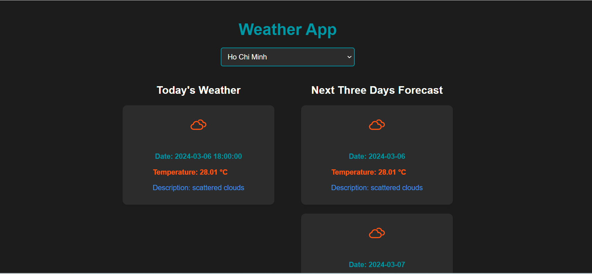

# knorex
weatherapp
# Weather App

Welcome to the Weather App! This application allows you to check the current weather and the forecast for the next three days in various cities around the world.
## Screenshots

## Demo

Check out the [live demo](https://knorex123.vercel.app/) of the Weather App!

## Features

- Select a City: Choose a city from the dropdown menu to view its weather information.
- Today's Weather:
  - Date: Date of the weather report.
  - Temperature: Current temperature in Celsius.
  - Description: Brief description of the weather conditions.
- Next Three Days Forecast:
  - For each of the next three days:
    - Date: Date of the forecast.
    - Temperature: Forecasted temperature in Celsius.
    - Description: Brief description of the weather conditions.

## Technologies Used

- React: JavaScript library for building user interfaces.
- React Icons: Library for customizable SVG icons.
- React Toastify: Library for toast notifications.
- OpenWeatherMap API: Provides weather data.

